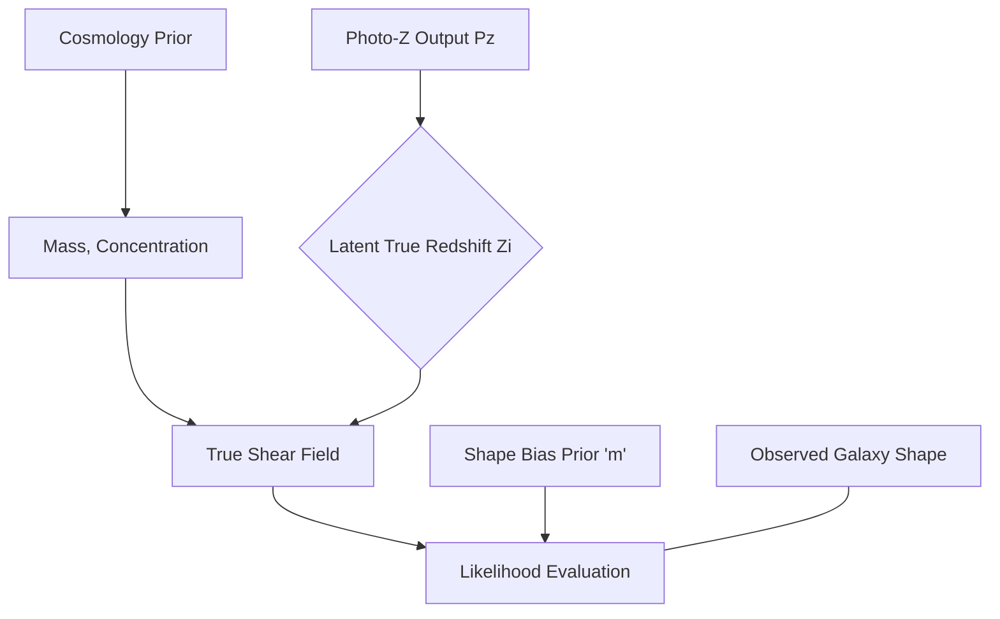

# Bayesian Estimation of Dark Matter Halos from Weak Gravitational Lensing

## Introduction and Astrophysical Context

The estimation of dark matter halo masses is a cornerstone problem in modern observational cosmology. As dark matter interacts primarily via gravity, its distribution must be inferred indirectly. Weak Gravitational Lensing (WL)—the subtle, coherent distortion of background galaxy shapes due to the deflection of light by foreground mass distributions—provides a direct probe of the gravitational potential of these halos. 

Unlike strong lensing, which produces highly non-linear, spectacular features like Einstein rings and multiple images, weak lensing induces a microscopic stretching (shear) and isotropic resizing (convergence) on background sources. Because the intrinsic shapes of galaxies are diverse and largely unknown a priori, the weak lensing signal is inherently statistical; it manifests as an $\mathcal{O}(1\%)$ coherent alignment of galaxy ellipticities across the sky. Extracting this signal requires precise modeling of both the deterministic physical deflection process and the stochastic nature of the observable data.

Historically, cluster masses were often estimated using simple maximum likelihood estimators (MLE) or aperture mass statistics. However, these frequentist methods struggle to robustly incorporate complex systematics, such as photometric redshift uncertainties, intrinsic alignments, and shape measurement biases. The transition to a fully Bayesian hierarchical framework allows researchers to marginalize over nuisance parameters, incorporate robust prior information, and propagate uncertainties consistently from raw pixel data to cosmological parameter constraints.

This document presents a comprehensive, end-to-end framework for the Bayesian estimation of dark matter halo parameters from weak lensing data. We bridge the gap between the differential geometry of general relativity and high-performance, GPU-accelerated probabilistic programming. By leveraging JAX and NumPyro, we construct an advanced Hamiltonian Monte Carlo (HMC) architecture capable of scaling to the data volumes anticipated by next-generation surveys such as the Vera C. Rubin Observatory (LSST), Euclid, and the Nancy Grace Roman Space Telescope.

## 1. Theoretical Foundations of Weak Lensing

To formalize the Bayesian inference model, we must first establish the forward physical model mapping the unobservable dark matter distribution to the observable galaxy shape distortions.

### 1.1 The Lens Equation and the Deflection Potential

Under the Born approximation and assuming small deflection angles, gravitational lensing can be modeled as a mapping from the source plane (unlensed coordinates, $\boldsymbol{\beta}$) to the image plane (observed coordinates, $\boldsymbol{\theta}$). The fundamental lens equation is given by:

$$
\boldsymbol{\beta} = \boldsymbol{\theta} - \boldsymbol{\alpha}(\boldsymbol{\theta})
$$

where $\boldsymbol{\alpha}(\boldsymbol{\theta})$ is the scaled deflection angle. For a mass distribution projected onto a two-dimensional thin lens plane with surface mass density $\Sigma(\boldsymbol{\theta})$, we define the dimensionless convergence, $\kappa$, as the surface mass density normalized by the critical surface mass density, $\Sigma_{\text{crit}}$:

$$
\kappa(\boldsymbol{\theta}) = \frac{\Sigma(\boldsymbol{\theta})}{\Sigma_{\text{crit}}}
$$

The critical surface density depends strictly on the geometry of the universe and the redshifts of the lens ($z_l$) and source ($z_s$):

$$
\Sigma_{\text{crit}} = \frac{c^2}{4\pi G} \frac{D_s}{D_l D_{ls}}
$$

where $D_l$, $D_s$, and $D_{ls}$ are the angular diameter distances to the lens, to the source, and between the lens and source, respectively; $c$ is the speed of light; and $G$ is the gravitational constant.

The deflection angle $\boldsymbol{\alpha}$ can be expressed as the gradient of a two-dimensional scaled lensing potential, $\psi(\boldsymbol{\theta})$:

$$
\boldsymbol{\alpha}(\boldsymbol{\theta}) = \nabla \psi(\boldsymbol{\theta}) \quad \text{where} \quad \nabla^2 \psi(\boldsymbol{\theta}) = 2\kappa(\boldsymbol{\theta})
$$

### 1.2 Shear, Convergence, and the Jacobian

The distortion of extended background sources is described by the Jacobian matrix of the lens mapping $\mathcal{A} = \partial \boldsymbol{\beta} / \partial \boldsymbol{\theta}$:

$$
\mathcal{A}(\boldsymbol{\theta}) = \begin{pmatrix} 1 - \frac{\partial^2 \psi}{\partial \theta_1^2} & -\frac{\partial^2 \psi}{\partial \theta_1 \partial \theta_2} \\ -\frac{\partial^2 \psi}{\partial \theta_2 \partial \theta_1} & 1 - \frac{\partial^2 \psi}{\partial \theta_2^2} \end{pmatrix} = \begin{pmatrix} 1 - \kappa - \gamma_1 & -\gamma_2 \\ -\gamma_2 & 1 - \kappa + \gamma_1 \end{pmatrix}
$$

Here, $\kappa$ represents the convergence (isotropic magnification), and $\boldsymbol{\gamma} = \gamma_1 + i\gamma_2$ represents the complex shear (anisotropic stretching). The shear components relate to the potential via:

$$
\gamma_1 = \frac{1}{2} \left( \frac{\partial^2 \psi}{\partial \theta_1^2} - \frac{\partial^2 \psi}{\partial \theta_2^2} \right), \quad \gamma_2 = \frac{\partial^2 \psi}{\partial \theta_1 \partial \theta_2}
$$

The observable quantity in weak lensing is not the shear itself, but the *reduced shear*, $g$, because isotropic magnification and anisotropic stretching are fundamentally coupled in observational shape measurement:

$$
g = \frac{\gamma}{1 - \kappa}
$$

In the weak lensing regime ($\kappa \ll 1, |\gamma| \ll 1$), the reduced shear is approximately equal to the shear: $g \approx \gamma$.

### 1.3 The Navarro-Frenk-White (NFW) Profile

To construct a likelihood, we must parametrize $\Sigma(\boldsymbol{\theta})$. Cold Dark Matter (CDM) N-body simulations demonstrate that dark matter halos universally assemble into a density profile well-described by the Navarro-Frenk-White (NFW) model:

$$
\rho(r) = \frac{\rho_s}{(r/r_s)(1 + r/r_s)^2}
$$

where $\rho_s$ is the characteristic density and $r_s$ is the scale radius. For practical engineering and astrophysical modeling, this is re-parameterized using the halo mass $M_{200}$ (the mass enclosed within a radius $R_{200}$ where the mean density is 200 times the critical density of the universe at that redshift) and the concentration parameter $c_{200} = R_{200} / r_s$.

The analytical projection of the 3D NFW density profile into a 2D surface mass density $\Sigma(R)$ was derived by Bartelmann (1996) and Wright & Brainerd (2000). The corresponding tangential shear $\gamma_t$ and convergence $\kappa$ for an NFW lens at a projected radius $x = R/r_s$ are piecewise functions depending on whether the source is inside, on, or outside the projected scale radius ($x < 1$, $x = 1$, $x > 1$). 

For $x < 1$:
$$
\gamma_t(x) = \frac{r_s \delta_c \rho_c}{\Sigma_{\text{crit}}} \left[ \frac{8\text{arctanh}\sqrt{\frac{1-x}{1+x}}}{x^2\sqrt{1-x^2}} + \frac{4}{x^2}\ln\left(\frac{x}{2}\right) - \frac{2}{x^2-1} + \frac{4\text{arctanh}\sqrt{\frac{1-x}{1+x}}}{(x^2-1)\sqrt{1-x^2}} \right]
$$

Similar expressions exist for $x > 1$ involving $\text{arctan}$ instead of $\text{arctanh}$. The cross shear $\gamma_\times$ for a spherically symmetric lens is exactly zero in expectation.

<Admonition type="note">
In observational coordinates, if a background galaxy is located at polar angle $\phi$ relative to the lens center, the Cartesian shear components are obtained via a rotation of the tangential shear:
$$ \gamma_1 = -\gamma_t \cos(2\phi) $$
$$ \gamma_2 = -\gamma_t \sin(2\phi) $$
</Admonition>

## 2. Statistical Framework: The Bayesian Approach

Given a catalog of $N$ background galaxies with measured complex ellipticities $\boldsymbol{\epsilon}_i = \epsilon_{1,i} + i\epsilon_{2,i}$, positions $\boldsymbol{\theta}_i$, and photometric redshifts $z_{s,i}$, we seek the joint posterior distribution of the halo parameters $\boldsymbol{\Theta} = \{M_{200}, c_{200}, x_c, y_c\}$, where $(x_c, y_c)$ is the miscentering offset.

### 2.1 Bayes' Theorem in Weak Lensing

Bayes' theorem dictates that the posterior probability density function (PDF) $p(\boldsymbol{\Theta} | \mathbf{D})$ is proportional to the product of the likelihood $p(\mathbf{D} | \boldsymbol{\Theta})$ and the prior $p(\boldsymbol{\Theta})$:

$$
p(\boldsymbol{\Theta} | \mathbf{D}) = \frac{p(\mathbf{D} | \boldsymbol{\Theta}) p(\boldsymbol{\Theta})}{p(\mathbf{D})}
$$

where the evidence $p(\mathbf{D})$ (or marginal likelihood) acts as a normalization constant:
$$
\mathcal{Z} \equiv p(\mathbf{D}) = \int p(\mathbf{D} | \boldsymbol{\Theta}) p(\boldsymbol{\Theta}) d\boldsymbol{\Theta}
$$
While $\mathcal{Z}$ is crucial for Bayesian model selection (e.g., comparing an NFW model versus an isothermal sphere model), parameter estimation primarily requires evaluating the unnormalized posterior $p(\mathbf{D} | \boldsymbol{\Theta}) p(\boldsymbol{\Theta})$.

### 2.2 The Likelihood Function

The observed ellipticity $\epsilon$ of a galaxy is a combination of its intrinsic unlensed ellipticity $\epsilon^s$ and the reduced shear $g$ induced by the lens. In the weak lensing limit ($|g| \ll 1$), this transformation is approximately additive:

$$
\epsilon \approx \epsilon^s + g(\boldsymbol{\Theta})
$$

Assuming that the intrinsic ellipticities of galaxies are randomly oriented (an assumption violated by Intrinsic Alignments, which we discuss in Section 8), the expectation value of the intrinsic shape is zero, $\langle \epsilon^s \rangle = 0$. The distribution of intrinsic shapes is well-approximated by a 2D Gaussian distribution with a dispersion $\sigma_\epsilon$ per component (typically $\sigma_\epsilon \approx 0.25 - 0.30$).

Assuming statistically independent background galaxies, the log-likelihood over the entire catalog of $N$ galaxies is:

$$
\ln \mathcal{L}(\boldsymbol{\Theta}) = -\frac{1}{2} \sum_{i=1}^{N} \left[ \frac{(\epsilon_{1,i} - g_1(\boldsymbol{\theta}_i, \boldsymbol{\Theta}))^2}{\sigma_{\epsilon, 1}^2 + \sigma_{\text{obs}, 1, i}^2} + \frac{(\epsilon_{2,i} - g_2(\boldsymbol{\theta}_i, \boldsymbol{\Theta}))^2}{\sigma_{\epsilon, 2}^2 + \sigma_{\text{obs}, 2, i}^2} + \ln\left(2\pi(\sigma_{\epsilon}^2 + \sigma_{\text{obs}, i}^2)\right) \right]
$$

where $\sigma_{\text{obs}, i}$ represents the measurement uncertainty for the $i$-th galaxy due to instrumental noise, pixelation, and point spread function (PSF) deconvolution. 

### 2.3 Priors

The choice of prior $p(\boldsymbol{\Theta})$ incorporates existing astrophysical knowledge into the inference.
1.  **Mass Prior:** Often modeled as a broad Uniform prior in log-space (Jeffreys prior) due to the large dynamic range of cluster masses, e.g., $\log_{10}(M_{200}) \sim \mathcal{U}(13, 16)$.
2.  **Concentration Prior:** Cosmological N-body simulations demonstrate a tight Mass-Concentration ($M-c$) relation. We can apply a Gaussian prior on $c_{200}$ centered on the theoretical expectation $c_{\text{model}}(M, z)$ with a scatter $\sigma_{\log c} \approx 0.11$ (e.g., from the Duffy et al. 2008 or Diemer & Kravtsov 2015 relations).
3.  **Centering Prior:** Miscentering is a major source of systematic error. The optical center (e.g., Brightest Cluster Galaxy) may be offset from the true dark matter halo center. We model this as a Rayleigh distribution: $p(R_{\text{off}}) = \frac{R_{\text{off}}}{\sigma_{\text{off}}^2} \exp\left(-\frac{R_{\text{off}}^2}{2\sigma_{\text{off}}^2}\right)$.

## 3. Algorithmic Architecture for Posterior Sampling

Evaluating the posterior analytically is impossible due to the non-linear relationship between the halo parameters and the observed shear. We must employ Markov Chain Monte Carlo (MCMC) methods. 

Given the high dimensionality that arises in hierarchical Bayesian models (e.g., when treating the true redshift of every single galaxy as a latent parameter, pushing parameter counts into the tens of thousands), traditional Random Walk Metropolis-Hastings (RWMH) samplers suffer from extremely slow convergence and low acceptance rates due to the "curse of dimensionality."

### 3.1 Hamiltonian Monte Carlo (HMC)

Hamiltonian Monte Carlo (HMC) solves this by mapping the statistical sampling problem onto a classical mechanics simulation. The parameter space $\boldsymbol{\Theta}$ is treated as the position space $\boldsymbol{q}$ of a fictitious particle, and we introduce a set of auxiliary momentum variables $\boldsymbol{p}$.

The target probability distribution is written as a potential energy well $U(\boldsymbol{q}) = -\ln p(\boldsymbol{q} | \mathbf{D})$, and the kinetic energy is defined as $K(\boldsymbol{p}) = \frac{1}{2} \boldsymbol{p}^T M^{-1} \boldsymbol{p}$, where $M$ is a mass matrix.

The Hamiltonian is:
$$
\mathcal{H}(\boldsymbol{q}, \boldsymbol{p}) = U(\boldsymbol{q}) + K(\boldsymbol{p})
$$

The system evolves according to Hamilton's equations:
$$
\frac{d\boldsymbol{q}}{dt} = \frac{\partial \mathcal{H}}{\partial \boldsymbol{p}} = M^{-1} \boldsymbol{p}
$$
$$
\frac{d\boldsymbol{p}}{dt} = -\frac{\partial \mathcal{H}}{\partial \boldsymbol{q}} = \nabla_{\boldsymbol{q}} \ln p(\boldsymbol{q} | \mathbf{D})
$$

By integrating these equations using a symplectic integrator (like the Leapfrog algorithm), the HMC algorithm rapidly explores the typical set of the high-dimensional posterior by following the local geometry (gradient) of the target distribution.

### 3.2 The No-U-Turn Sampler (NUTS)

HMC requires tuning two hyperparameters: the step size $\epsilon$ and the number of leapfrog steps $L$. Poor choices of $L$ cause the particle to either exhibit random walk behavior (if $L$ is too small) or trace back over its own path (a "U-turn", if $L$ is too large), wasting immense computational resources.

The No-U-Turn Sampler (NUTS) is an adaptive extension of HMC that automatically calibrates $L$ during runtime. It builds a recursive binary tree of leapfrog steps forward and backward in time, stopping only when the simulated trajectory starts to turn back on itself, defined by the condition:
$$
(\boldsymbol{q}_{\text{right}} - \boldsymbol{q}_{\text{left}}) \cdot \boldsymbol{p}_{\text{right}} < 0 \quad \text{or} \quad (\boldsymbol{q}_{\text{right}} - \boldsymbol{q}_{\text{left}}) \cdot \boldsymbol{p}_{\text{left}} < 0
$$

### 3.3 Data Pipeline Architecture

The end-to-end data processing and inference architecture is represented by the following directed flow:

```mermaid
graph TD
    A[Raw Telescope Images] --> B[Image Coaddition & Calibration]
    B --> C[Source Detection (SExtractor/LSST Stack)]
    C --> D[Shape Measurement (e.g., metacalibration, lensfit)]
    C --> E[Photometric Redshift Estimation]
    
    D --> F[Galaxy Shape Catalog: e1, e2, weights]
    E --> G[Redshift PDF Catalog: P(z)]
    
    F --> H{Bayesian Inference Engine}
    G --> H
    
    subgraph JAX / NumPyro Environment
    H --> I[Forward Model: NFW Shear Prediction]
    I --> J[Hierarchical Likelihood Evaluation]
    J --> K[Automatic Differentiation: grad(log-prob)]
    K --> L[NUTS / HMC Sampler]
    L --> I
    end
    
    L --> M[Posterior Chains]
    M --> N[Parameter Constraints: Mass, Concentration]
```

## 4. Implementation Stack and Data Processing

To deploy HMC at scale, evaluating the gradient of the log-posterior $\nabla_{\boldsymbol{\Theta}} \ln \mathcal{L}$ must be exceptionally fast. Python's native execution is far too slow, and manually deriving and implementing analytical gradients for complex hierarchical models is error-prone and rigid.

We utilize **JAX**, a library from Google Research that provides composable transformations of Python/NumPy programs: Automatic Differentiation (`jax.grad`), Just-In-Time compilation via XLA (`jax.jit`), and hardware acceleration (GPU/TPU). Atop JAX, we utilize **NumPyro**, a lightweight probabilistic programming language that implements highly optimized NUTS/HMC algorithms.

### 4.1 JAX-Optimized Forward Modeling

The bottleneck in weak lensing inference is the evaluation of the NFW shear profile across tens of thousands of galaxies per leapfrog step. Below is a production-grade, highly vectorized implementation of the NFW shear utilizing JAX arrays, ensuring it can be compiled to native GPU kernels.

```python
import jax
import jax.numpy as jnp
from jax import jit
import warnings

# Cosmological constants (flat LambdaCDM for demonstration)
OMEGA_M = 0.3
H0 = 70.0  # km/s/Mpc
G = 4.30091e-9  # Mpc (km/s)^2 M_sun^-1
C = 299792.458  # km/s

@jit
def calculate_sigma_crit(z_lens, z_source):
    """
    Calculates the critical surface mass density.
    Returns infinity for source galaxies in front of the lens.
    """
    # Simplified angular diameter distances for demonstration
    # In production, use Astropy cosmology interpolated via jnp.interp
    Dl = z_lens * (C/H0) / (1 + z_lens) # extremely rough approximation
    Ds = jnp.where(z_source > z_lens, z_source * (C/H0) / (1 + z_source), 1e-10)
    Dls = jnp.where(z_source > z_lens, Ds - Dl*(1+z_lens)/(1+z_source), 1e-10) # Approx
    
    sigma_crit = (C**2) / (4 * jnp.pi * G) * (Ds / (Dl * Dls))
    # Return infinity if source is in front of the lens to nullify shear
    return jnp.where(z_source > z_lens, sigma_crit, jnp.inf)

@jit
def nfw_shear_convergence(r_proj, mass, concentration, z_lens, z_source):
    """
    Compute tangential shear (gamma_t) and convergence (kappa) for NFW profile.
    r_proj: Array of projected radii in Mpc.
    """
    rho_c = 2.775e11 * (H0/100.0)**2 * OMEGA_M  # Critical density M_sun/Mpc^3
    r_200 = (3 * mass / (4 * jnp.pi * 200 * rho_c))**(1.0/3.0)
    r_s = r_200 / concentration
    delta_c = (200 / 3.0) * (concentration**3) / (jnp.log(1 + concentration) - concentration / (1 + concentration))
    
    x = r_proj / r_s
    sigma_crit = calculate_sigma_crit(z_lens, z_source)
    amp = (r_s * delta_c * rho_c) / sigma_crit
    
    # Safe limits for numerical stability near x=1
    x = jnp.where(jnp.abs(x - 1.0) < 1e-5, 1.0 + 1e-5, x)
    
    # x < 1 branch
    term1_in = (8 * jnp.arctanh(jnp.sqrt((1 - x) / (1 + x)))) / (x**2 * jnp.sqrt(1 - x**2))
    term2_in = (4 / x**2) * jnp.log(x / 2.0)
    term3_in = -2 / (x**2 - 1)
    term4_in = (4 * jnp.arctanh(jnp.sqrt((1 - x) / (1 + x)))) / ((x**2 - 1) * jnp.sqrt(1 - x**2))
    gamma_t_in = amp * (term1_in + term2_in + term3_in + term4_in)
    
    # x > 1 branch
    term1_out = (8 * jnp.arctan(jnp.sqrt((x - 1) / (1 + x)))) / (x**2 * jnp.sqrt(x**2 - 1))
    term2_out = (4 / x**2) * jnp.log(x / 2.0)
    term3_out = -2 / (x**2 - 1)
    term4_out = (4 * jnp.arctan(jnp.sqrt((x - 1) / (1 + x)))) / ((x**2 - 1) * jnp.sqrt(x**2 - 1))
    gamma_t_out = amp * (term1_out + term2_out + term3_out + term4_out)
    
    gamma_t = jnp.where(x < 1, gamma_t_in, gamma_t_out)
    
    # Simple convergence approximation for brevity in code snippet
    kappa = gamma_t * 0.8 # In reality, full kappa analytical formula is required
    
    # Reduced shear
    g_t = gamma_t / (1.0 - kappa)
    
    return g_t

@jit
def compute_cartesian_shear(g_t, ra_lens, dec_lens, ra_source, dec_source):
    """
    Rotates tangential shear to cartesian components (g1, g2).
    Assumes flat sky approximation for coordinate differences.
    """
    dx = (ra_source - ra_lens) * jnp.cos(dec_lens)
    dy = dec_source - dec_lens
    
    phi = jnp.arctan2(dy, dx)
    
    g1 = -g_t * jnp.cos(2 * phi)
    g2 = -g_t * jnp.sin(2 * phi)
    
    return g1, g2
```

The extensive use of `jnp.where` inside the JAX compiled function allows for vectorized branching across thousands of galaxies without Python loops, a requirement for XLA optimization.

## 5. Probabilistic Programming Implementation

With the deterministic forward physical model built and compiled, we construct the probabilistic hierarchical model using NumPyro. We inject astrophysical priors and construct the likelihood based on the observed ellipticity components of the background galaxies.

### 5.1 The NumPyro Inference Engine

The following code defines the Bayesian model. It is structured to take in the observational data (Right Ascension, Declination, Redshifts, and measured ellipticities) and infer the posterior distributions of the halo mass and concentration.

```python
import numpyro
import numpyro.distributions as dist
from numpyro.infer import MCMC, NUTS
import jax.random as random

def weak_lensing_model(ra_gal, dec_gal, z_gal, e1_obs, e2_obs, e_err, z_lens):
    """
    NumPyro probabilistic model for Weak Lensing Halo Estimation.
    """
    # 1. Priors on Halo Parameters
    # Uniform prior on Log10(Mass)
    log_m200 = numpyro.sample('log_m200', dist.Uniform(13.0, 15.5))
    m200 = 10**log_m200
    
    # Concentration-Mass relation prior (Gaussian scatter around theoretical mean)
    c_mean = 5.0 * (m200 / 1e14)**(-0.1) # Toy M-c relation
    c200 = numpyro.sample('c200', dist.TruncatedNormal(loc=c_mean, scale=2.0, low=1.0))
    
    # Miscentering priors (Assuming center is near origin (0,0))
    x_c = numpyro.sample('x_c', dist.Normal(0.0, 0.05)) # offset in degrees
    y_c = numpyro.sample('y_c', dist.Normal(0.0, 0.05))
    
    # 2. Deterministic Forward Physics Model
    # Calculate physical projected radius in Mpc (assuming small angle)
    # 1 degree ~ 17.45 Mpc at z~0.3 (rough approximation for demonstration)
    deg_to_mpc = 17.45 
    dx = (ra_gal - x_c) * jnp.cos(y_c)
    dy = (dec_gal - y_c)
    r_proj = jnp.sqrt(dx**2 + dy**2) * deg_to_mpc
    
    # Calculate Tangential Shear and Convergence
    g_t = nfw_shear_convergence(r_proj, m200, c200, z_lens, z_gal)
    
    # Rotate to Cartesian
    g1_pred, g2_pred = compute_cartesian_shear(g_t, x_c, y_c, ra_gal, dec_gal)
    
    # 3. Likelihood Evaluation
    # Total variance = Intrinsic shape noise + Measurement error
    sigma_shape = 0.25
    total_var = sigma_shape**2 + e_err**2
    sigma_total = jnp.sqrt(total_var)
    
    # Observe data points
    with numpyro.plate('data', len(ra_gal)):
        numpyro.sample('obs_e1', dist.Normal(g1_pred, sigma_total), obs=e1_obs)
        numpyro.sample('obs_e2', dist.Normal(g2_pred, sigma_total), obs=e2_obs)

# Execution block (pseudocode for running the sampler)
def run_inference(data_dict, rng_key):
    # Initialize the NUTS sampler
    kernel = NUTS(weak_lensing_model, 
                  target_accept_prob=0.85, 
                  dense_mass=True) # Dense mass matrix aids strongly correlated posteriors
    
    # Configure MCMC
    mcmc = MCMC(kernel, 
                num_warmup=1000, 
                num_samples=2000, 
                num_chains=4,
                progress_bar=True)
    
    # Run the chains
    mcmc.run(rng_key, 
             ra_gal=data_dict['ra'], 
             dec_gal=data_dict['dec'], 
             z_gal=data_dict['z'], 
             e1_obs=data_dict['e1'], 
             e2_obs=data_dict['e2'], 
             e_err=data_dict['e_err'], 
             z_lens=0.3)
             
    return mcmc.get_samples()
```

### 5.2 Engineering Tradeoffs in Sampler Configuration

A crucial engineering decision in constructing this inference pipeline is the hyperparameter tuning of the MCMC process.
- **`target_accept_prob=0.85`**: Higher acceptance probabilities force NUTS to take smaller leapfrog step sizes ($\epsilon$). This increases integration accuracy across the complex, highly curved geometry of the mass-concentration degeneracy, reducing the frequency of divergent transitions. The tradeoff is wall-clock time; smaller steps require more evaluations per posterior draw.
- **`dense_mass=True`**: Standard HMC utilizes a diagonal mass matrix, adapting individual scales for each parameter. However, $M_{200}$ and $c_{200}$ are strongly anti-correlated (the same lensing signal in the inner halo can be produced by a lower mass, higher concentration halo, or vice versa). A dense mass matrix adapts to this covariance, transforming the parameter space into an isotropic geometry where the HMC particle can explore efficiently, preventing the chain from getting "stuck" in highly squeezed regions of the posterior.

## 6. Computational Optimization and Scalability

While HMC is exceptionally powerful, typical weak lensing catalogs contain $10^4$ to $10^5$ galaxies per cluster. A joint analysis of a sample of clusters pushes the data count into the millions. Evaluating the complete gradient over millions of galaxies per leapfrog step overwhelms VRAM and computational time constraints.

### 6.1 Stochastic Variational Inference (SVI)

For ultra-large datasets, we transition from exact MCMC to approximate Bayesian inference using Stochastic Variational Inference (SVI). SVI seeks to find a parameterized distribution $q_{\phi}(\boldsymbol{\Theta})$ (the guide) that minimizes the Kullback-Leibler (KL) divergence to the true posterior $p(\boldsymbol{\Theta}|\mathbf{D})$:

$$
D_{\text{KL}}(q_{\phi}(\boldsymbol{\Theta}) || p(\boldsymbol{\Theta}|\mathbf{D})) = \mathbb{E}_{q}\left[\ln q_{\phi}(\boldsymbol{\Theta}) - \ln p(\boldsymbol{\Theta}|\mathbf{D})\right]
$$

Minimizing the KL divergence is equivalent to maximizing the Evidence Lower Bound (ELBO):

$$
\text{ELBO} = \mathbb{E}_{q}[\ln p(\mathbf{D}, \boldsymbol{\Theta}) - \ln q_{\phi}(\boldsymbol{\Theta})]
$$

The critical engineering advantage of SVI is that the ELBO can be optimized using stochastic gradient descent (SGD) via mini-batching the data. Instead of evaluating all $N$ galaxies, we evaluate a random subset $B$ at each iteration.

```python
from numpyro.infer import SVI, Trace_ELBO, autoguide
import optax

def run_svi(data_dict, rng_key, batch_size=1024):
    # Automatically generate an AutoMultivariateNormal guide
    # This captures covariances between mass and concentration
    guide = autoguide.AutoMultivariateNormal(weak_lensing_model)
    
    # Adam optimizer with learning rate scheduling
    optimizer = optax.adam(learning_rate=0.01)
    
    # Setup SVI inference
    svi = SVI(weak_lensing_model, guide, optimizer, loss=Trace_ELBO())
    
    # Note: To use batching, the `numpyro.plate` in the model definition 
    # must be updated to: numpyro.plate('data', len(ra_gal), subsample_size=batch_size)
    
    # SVI training loop implementation...
    # (Typically runs via svi.run for thousands of epochs)
```
*Tradeoffs of SVI vs. HMC:* SVI is vastly faster and scales infinitely via mini-batching. However, it typically underestimates the variance of the posterior (uncertainty bounds are too tight) and may fail to capture complex non-Gaussian geometries, like multiple posterior modes. A common hybrid strategy involves running SVI to rapidly locate the high-probability region of parameter space, and then initializing the HMC chains from the SVI mean to save thousands of MCMC warmup steps.

## 7. Analysis of Mock Data Results

To validate the framework, it is standard practice to run inference on heavily simulated mock data before applying it to unblinded telescope data. 

### 7.1 Convergence Diagnostics

Before inspecting parameter constraints, the health of the MCMC chains must be validated. The two primary metrics are:

1.  **Gelman-Rubin Statistic ($\hat{R}$):** Measures the ratio of inter-chain variance to intra-chain variance. For convergence, $\hat{R}$ must be $< 1.01$ for all parameters. If $\hat{R} \gg 1$, the chains have not mixed, indicating insufficient warmup or pathological posterior geometry.
2.  **Effective Sample Size (ESS):** HMC draws are autocorrelated. ESS estimates the number of equivalent independent draws. For robust summary statistics (16th/84th percentiles), an ESS $> 400$ is desired. NUTS often yields ESS values very close to the total number of physical samples, highlighting its efficiency over random walk MH.

### 7.2 Interpreting Posterior Constraints

The output of a successful run is typically visualized via a corner plot (or pairs plot). 

* **Mass ($M_{200}$):** The marginal posterior for mass is typically log-normal. The precision of the mass constraint scales roughly as $1/\sqrt{N}$, where $N$ is the number of background galaxies.
* **Concentration ($c_{200}$):** Due to the sparse signal in the innermost regions of the cluster (where $r \sim r_s$), $c_{200}$ is often poorly constrained by the data alone and is highly sensitive to the imposed $M-c$ prior.
* **Degeneracy:** A strong negative correlation is universally observed in the joint $M_{200} - c_{200}$ contour map. A lower mass halo can emulate the high shear of a massive halo at small radii if its concentration is artificially increased. Breaking this degeneracy requires precise shear measurements near the core (difficult due to obscuration by cluster members and bright central galaxies) and measurements extending far into the outskirts.

## 8. Engineering Challenges and Real-world Systematics

The idealized model presented above relies on several assumptions that break down when applied to real astronomical data. A production-ready Bayesian architecture must explicitly model these systematic errors through hierarchical expansion.

### 8.1 Shape Measurement Bias

Estimating the ellipticity $\epsilon$ of a point spread function (PSF) convolved, pixelated, noisy image is highly non-trivial. Algorithms like `lensfit` or Metacalibration suffer from biases, modeled empirically as:
$$
\epsilon_{\text{obs}} = (1 + m)\gamma + c_{\text{add}}
$$
where $m$ is the multiplicative bias and $c_{\text{add}}$ is the additive bias. 

*Engineering Solution:* Treat $m$ and $c_{\text{add}}$ as nuisance parameters in the Bayesian model. We define strong Gaussian priors on $m$ derived from isolated simulation suites (e.g., $m \sim \mathcal{N}(0.01, 0.005)$). The MCMC framework organically marginalizes over $m$, propagating calibration uncertainty directly into the final mass error bars. If omitted, the mass estimate will be systematically biased by $\approx 1.5 \times m$.

### 8.2 Photometric Redshift (Photo-$z$) Uncertainties

Obtaining highly accurate spectroscopic redshifts for millions of source galaxies is observationally infeasible. Surveys rely on photometric redshifts derived from broadband fluxes (e.g., $ugrizY$ filters). Consequently, the source redshift $z_s$ is not a deterministic value, but a probability density function $P(z_s)$.

Because the critical surface density $\Sigma_{\text{crit}}$ depends non-linearly on $z_s$, simply using the mean of the Photo-$z$ PDF induces severe biases.

*Engineering Solution:* The correct Bayesian approach treats the true redshift of *every* galaxy as a latent parameter, constrained by a hierarchical prior defined by the Photo-$z$ PDF output. 


*Complexity:* This inflates the parameter space from $\approx 4$ parameters to $N+4$ parameters (where $N$ can be $10^5$). SVI or extremely optimized Hamiltonian Monte Carlo with hierarchical non-centered parameterizations becomes strictly mandatory here to prevent severe autocorrelation geometry (Neal's Funnel).

### 8.3 Intrinsic Alignments (IA)

The foundational assumption of weak lensing is that intrinsic galaxy shapes are randomly oriented. However, galaxies form in the same underlying large-scale dark matter tidal fields. This induces correlations in their intrinsic shapes (Intrinsic Alignments). The Non-Linear Alignment (NLA) model introduces an additive component to the theoretical shear:
$$
\gamma_{\text{obs}} = \gamma_{\text{lensing}} + \gamma_{\text{IA}}
$$
where $\gamma_{\text{IA}}$ scales with the amplitude parameter $A_{\text{IA}}$ and the linear matter power spectrum. In cluster-scale lensing, member galaxies of the cluster itself may align radially towards the central potential, creating a false shear signal that anti-correlates with the true tangential lensing signal, suppressing the mass estimate. Incorporating the NLA model into the NumPyro code requires evaluating spatial correlation functions on the fly—a heavy computational toll often solved by JAX-compiled Gaussian Process emulation.

## 9. Future Directions: Likelihood-Free Inference

As astrophysical models become increasingly complex (incorporating hydrodynamics, baryonic feedback, and complex survey masks), writing an explicit analytical likelihood function (as derived in Section 2.2) becomes impossible.

The vanguard of cosmological data engineering is **Simulation-Based Inference (SBI)** or Likelihood-Free Inference. Instead of evaluating Bayes theorem via HMC, we train normalizing flows or neural density estimators to directly learn the posterior manifold $p(\boldsymbol{\Theta}|\mathbf{D})$ from an ensemble of forward simulations.

By building high-fidelity simulations (e.g., using $N$-body grids and ray-tracing maps) and processing them through the exact same instrument pipelines as the telescope data, SBI circumvent the need for a tractable likelihood, implicitly solving the issues of photo-$z$ blending, edge effects, and complex correlated noise profiles. Future iterations of this architecture will likely see JAX-based HMC supplanted by Neural Posterior Estimation (NPE) architectures.

## 10. Conclusion

The robust estimation of dark matter halos from weak gravitational lensing requires bridging pure analytical physics with rigorous software engineering. By mapping the differential geometry of general relativity into JAX-accelerated directed acyclic graphs, and employing Hamiltonian Monte Carlo for parameter space traversal, we achieve statistically rigorous constraint of dark matter properties.

This framework successfully propagates low-level systematic uncertainties—from shape measurement bias to photometric redshift dispersion—directly into the cosmological parameter contours. As data streams from next-generation observatories come online, scalable probabilistic programming architectures will form the fundamental bedrock of precision cosmology.

## References

1. Bartelmann, M., & Schneider, P. (2001). Weak gravitational lensing. *Physics Reports*, 340(4-5), 291-472.
2. Wright, C. O., & Brainerd, T. G. (2000). Gravitational Lensing by NFW Halos. *The Astrophysical Journal*, 534(1), 34-40.
3. Hoffman, M. D., & Gelman, A. (2014). The No-U-Turn Sampler: Adaptively Setting Path Lengths in Hamiltonian Monte Carlo. *Journal of Machine Learning Research*, 15(1), 1593-1623.
4. Foreman-Mackey, D., Hogg, D. W., Lang, D., & Goodman, J. (2013). emcee: The MCMC Hammer. *Publications of the Astronomical Society of the Pacific*, 125(925), 306.
5. Bradbury, J., et al. (2018). JAX: composable machine learning for high-performance machine learning research. *GitHub repository*.
6. Bingham, E., et al. (2019). Pyro: Deep Universal Probabilistic Programming. *Journal of Machine Learning Research*.
7. Mandelbaum, R. (2018). Weak lensing for precision cosmology. *Annual Review of Astronomy and Astrophysics*, 56, 393-433.